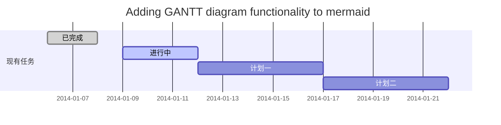
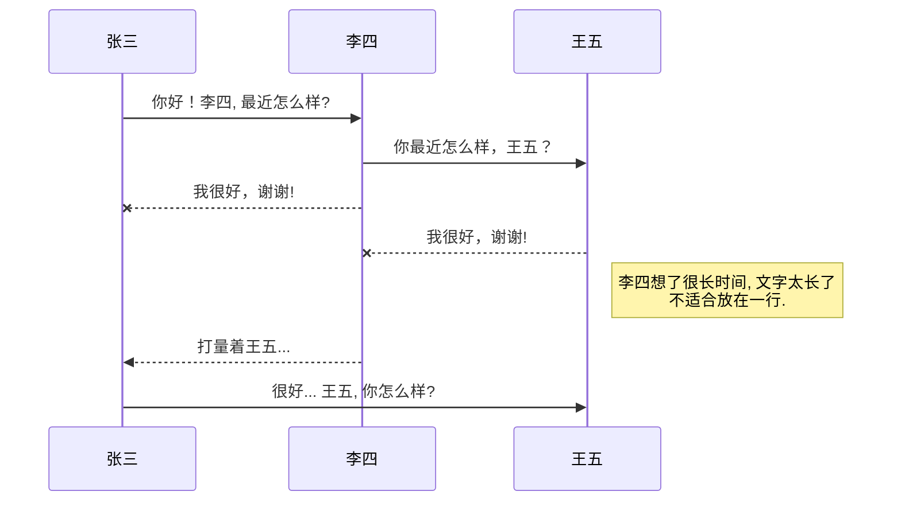
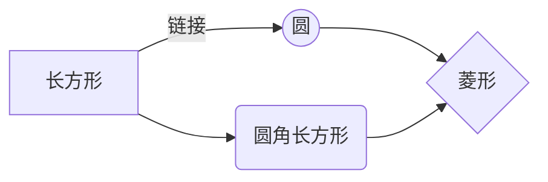

# 欢迎使用Markdown编辑器

你好！ 这是你第一次使用 **Markdown编辑器** 所展示的欢迎页。如果你想学习如何使用Markdown编辑器, 可以仔细阅读这篇文章，了解一下Markdown的基本语法知识。

## 新的改变

我们对Markdown编辑器进行了一些功能拓展与语法支持，除了标准的Markdown编辑器功能，我们增加了如下几点新功能，帮助你用它写博客：
1. 全新的 **KaTeX数学公式** 语法；
2. 增加了支持**甘特图的mermaid语法[^1]** 功能，[参考mermaid语法说明](https://mermaidjs.github.io/)；
 

## 合理的创建标题，有助于目录的生成

直接输入1次<kbd>#</kbd>，并按下<kbd>space</kbd>后，将生成1级标题。
输入2次<kbd>#</kbd>，并按下<kbd>space</kbd>后，将生成2级标题。
以此类推，我们支持6级标题。有助于使用`TOC`语法后生成一个完美的目录。


## 如何改变文本的样式

*强调文本* _强调文本_

**加粗文本** __加粗文本__

==标记文本==

~~删除文本~~

> 引用文本

H~2~O is是液体。

2^10^ 运算结果是 1024.


## 插入链接与图片

链接: [link](http://ruizhengyun.cn/).

图片: 

## 如何插入一段漂亮的代码片

```javascript
// An highlighted block
var foo = 'bar';
```


## 生成一个适合你的列表

- 项目
  - 项目
    - 项目

1. 项目1
2. 项目2
3. 项目3

- [ ] 计划任务
- [x] 完成任务


## 创建一个表格
一个简单的表格是这么创建的：

|项目     | Value|
|-------- | -----|
|电脑  | $1600|
|手机  | $12    |
|导管  | $1     |

### 设定内容居中、居左、居右
使用`:---------:`居中
使用`:----------`居左
使用`----------:`居右

| 第一列       | 第二列         | 第三列        |
|:-----------:| -------------:|:-------------|
| 第一列文本居中 | 第二列文本居右  | 第三列文本居左 | 


### SmartyPants
SmartyPants将ASCII标点字符转换为“智能”印刷标点HTML实体。例如：

|    TYPE   |ASCII                          |HTML |
|----------------|-------------------------------|-----------------------------|
|Single backticks|`'Isn't this fun?'`            |'Isn't this fun?'            |
|Quotes          |`"Isn't this fun?"`            |"Isn't this fun?"            |
|Dashes          |`-- is en-dash, --- is em-dash`|-- is en-dash, --- is em-dash|


## 如何创建一个注脚

一个具有注脚的文本。[^2]

[^2]: 注脚的解释


##  注释也是必不可少的

Markdown将文本转换为 HTML。

*[HTML]:   超文本标记语言


## KaTeX数学公式

您可以使用渲染LaTeX数学表达式 [KaTeX](https://khan.github.io/KaTeX/):

Gamma公式展示 $\Gamma(n) = (n-1)!\quad\forall
n\in\mathbb N$ 是通过欧拉积分

$$
\Gamma(z) = \int_0^\infty t^{z-1}e^{-t}dt\,.
$$

> 你可以找到更多关于的信息 **LaTeX** 数学表达式[here](http://meta.math.stackexchange.com/questions/5020/mathjax-basic-tutorial-and-quick-reference).


## 新的甘特图功能，丰富你的文章



- 关于 **甘特图** 语法，参考 [这儿](https://mermaidjs.github.io/),

## UML 图表

可以使用UML图表进行渲染。 [Mermaid](https://mermaidjs.github.io/). 例如下面产生的一个序列图：:



这将产生一个流程图:



- 关于 **Mermaid** 语法，参考 [这儿](https://mermaidjs.github.io/),

## FLowchart流程图

我们依旧会支持flowchart的流程图：
```flow
st=>start: Start|past:>http://www.google.com[blank]
e=>end: End:>http://www.google.com
op1=>operation: My Operation|past
op2=>operation: Stuff|current
sub1=>subroutine: My Subroutine|invalid
cond=>condition: Yes
or No?|approved:>http://www.google.com
c2=>condition: Good idea|rejected
io=>inputoutput: catch something...|request
st->op1(right)->cond
cond(yes, right)->c2
cond(no)->sub1(left)->op1
c2(yes)->io->e
c2(no)->op2->e
```

- 关于 **Flowchart流程图** 语法，参考 [这儿](http://adrai.github.io/flowchart.js/).
