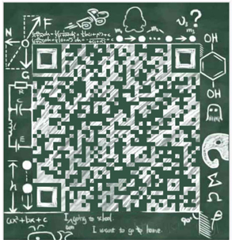

## 身份
* 80后的尾巴
* 前端工程师
* 不安于现状喜欢折腾的码农

## 信仰
代码是码给人看的，顺便在机器上运行下

## 宣言
文不在深，有新就行。字不在多，有意就好。斯是博客，唯吾技术。新库天天出，代码无陋空。谈笑天下事，调侃各类圈。
可以玩前端，阅源码。无社交之乱耳，无需求之劳形。左手上react，右手用vue。码农云：you happy is good!

## 交流
如果你酷爱技术、喜欢钻研、愿意去帮助他人发展，并且认为编程是别人不能剥夺的权利的话，欢迎加我

## 现状
在杭州传化集团，团队有30+前端，现在小组内每天都有半小时分享。
后续我也会坚持每周有更新吧，每天更新现在还很难做到，毕竟公司业务也挺紧急的。

## 联系方式

## 写点东西
* [Github](https://github.com/ruizhengyun)

<!-- http://www.4u4v.net/shi-yong-node-jsdockergraphqlmongodb-gou-jian-fu-wu.html -->
