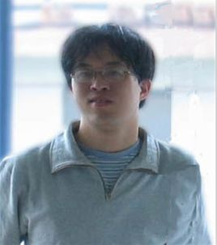
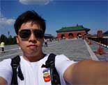

## 阮一峰老师

阮一峰，70后，英文名Frank。他原是上海财经大学世界经济博士研究生。主要研究宏观金融、货币政策与美国经济。目前在上海一所当地大学（上海金融学院 国际经贸学院）任教。除了写博客以外，他还有三个网站：微趣、Italo Calvino in China和读书公园。
[博客](http://www.ruanyifeng.com/home.html) · [es6](http://es6.ruanyifeng.com/)

 

## 鑫空间，鑫生活 

张鑫旭，09年华中科技大学毕业。现上海，就职于阅文集团，专注web前端偏前领域，钓鱼爱好者，著有《CSS世界》。
[博客](http://www.zhangxinxu.com/)

 

## 我的清单

芮正云，杭州一名前端。目前该站点正在建设中...

 

## 团队或个人
* [腾讯AlloyTeam](http://www.alloyteam.com/)
* [闲情写手](http://sentsin.com/)

## 工具库
* [VIM](https://vim-adventures.com/)
* [CodeTank](http://codetank.alloyteam.com/)

## 公众号
暂无
